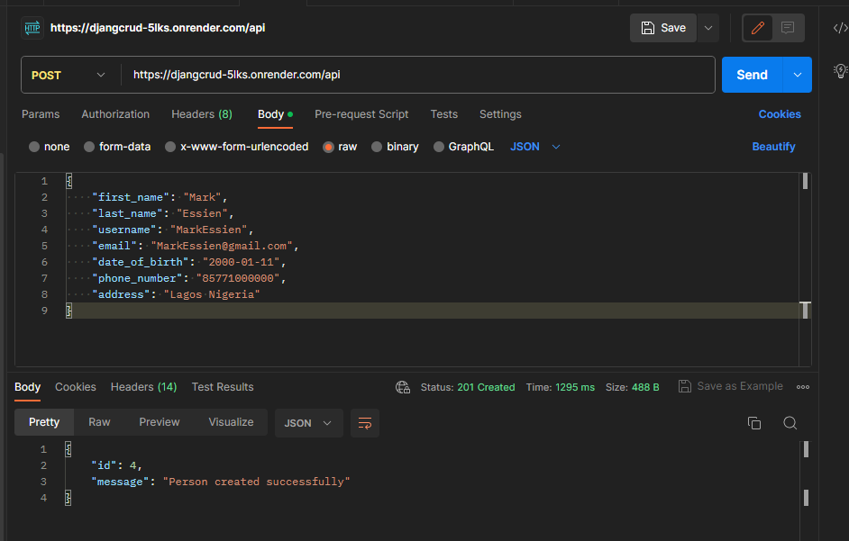
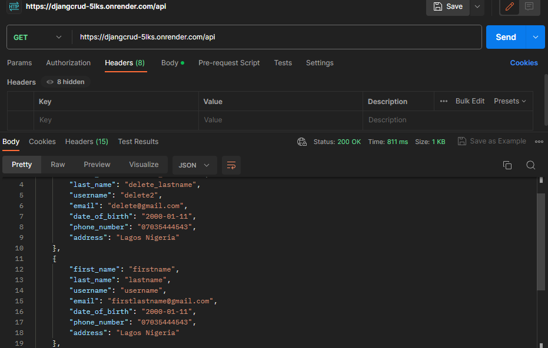
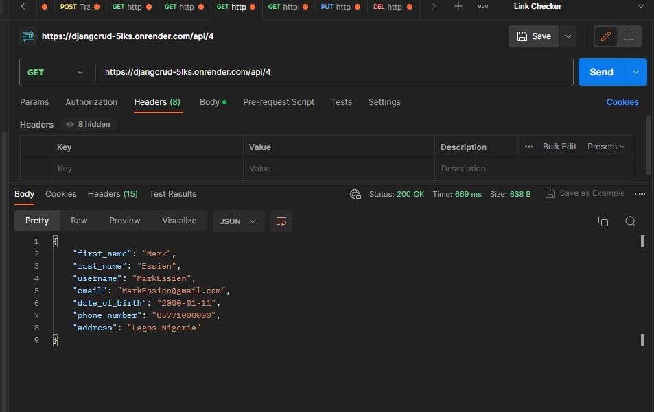
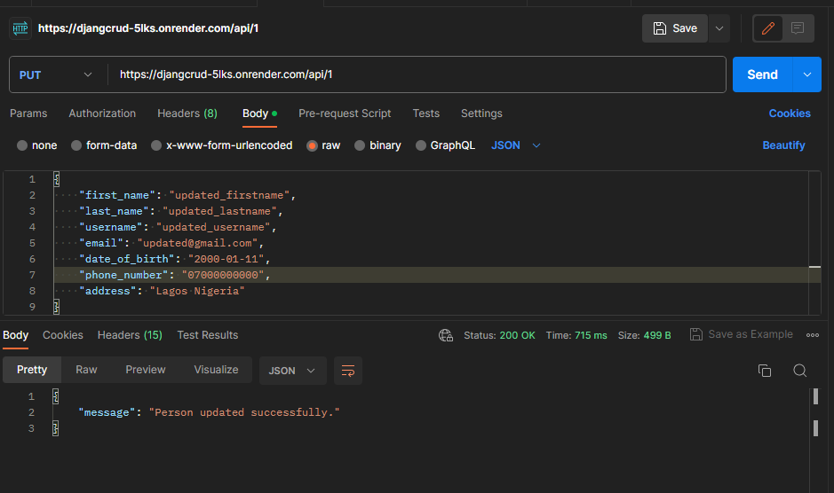

pip install -r requirements.txt

running API locally on your system after installing requirement.
py manage.py runserver

running on localhost:
    run url on postman: localhost/api or http://127.0.0.1:8000/api

running on live url:
    run url on Postman: https://djangcrud-5lks.onrender.com/api

1.  Adding a new person(create)=> post https://djangcrud-5lks.onrender.com/api

    

2.  To get all persons detail on DB(read)=> get https://djangcrud-5lks.onrender.com/api

    
    

3.  To fetch details of a person(read)=> get https://djangcrud-5lks.onrender.com/api/4
    
    

4.  Modifying details of an existing person(update)=> put /api/user_id

    

5.  Removing a person(delete) => delete /api/user_id

UML diagrams: https://drive.google.com/file/d/1Akm06_tHImRAENyEVZCZflzRL_8kUha7/view?usp=drive_link and https://drive.google.com/file/d/1u2_m5bwO49KjxM8LVVWiEwtXbkoJGxwN/view?usp=drive_link

To run test report:
command: python manage.py test

To display a summary of the code coverage, including which parts of your code were covered and which were not.
command: coverage run manage.py test
command: coverage report
