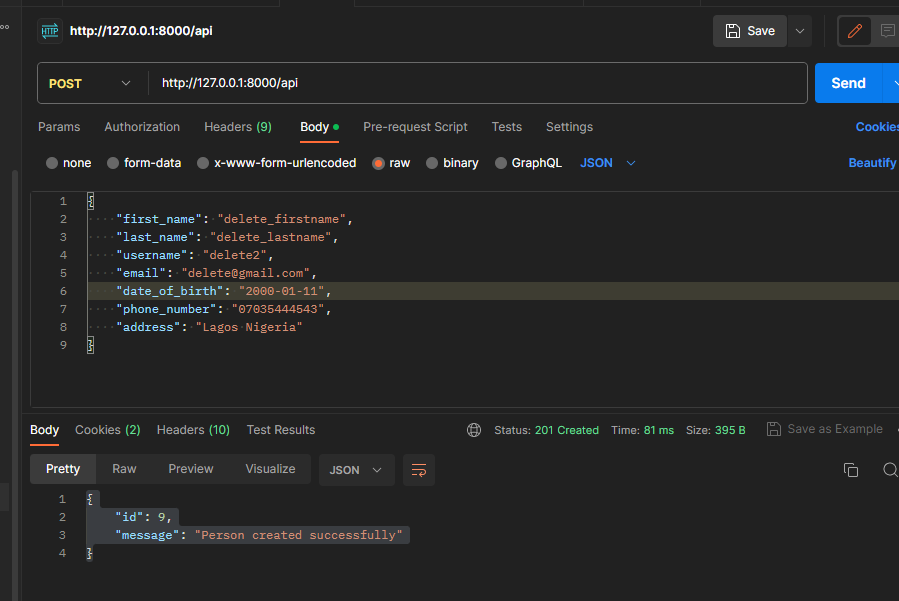

pip install -r requirements.txt

running API locally on your system after installing requirement.
py manage.py runserver

1.  Adding a new person(create)=> get /api
    

    request = {
        "first_name": "firstname",
        "last_name": "lastname",        
        "username": "username",
        "email": "email@gmail.com",
        "date_of_birth": "yyyy-mm-dd",
        "phone_number": "phone_number",
        "address": "address
    }

    response = {"id": user_id,"message": "Person created successfully"}

2.  To get all persons detail on DB(read)=> post /api/
  

    response=   [{
        "first_name": "firstname",
        "last_name": "lastname",
        "username": "username",
        "email": "email@gmail.com",
        "date_of_birth": "yyyy-mm-dd",
        "phone_number": "phone_number",
        "address": "address
    },{
        "first_name": "firstname",
        "last_name": "lastname",
        "username": "username",
        "email": "email@gmail.com",
        "date_of_birth": "yyyy-mm-dd",
        "phone_number": "phone_number",
        "address": "address
    }]

3.  To fetch details of a person(read)=> post /api/user_id
    
    response = {
        "first_name": "firstname",
        "last_name": "lastname",
        "username": "username",
        "email": "email@gmail.com",
        "date_of_birth": "yyyy-mm-dd",
        "phone_number": "phone_number",
        "address": "address
    }

4.  Modifying details of an existing person(update)=> put /api/user_id

    response= { "message": "Person updated successfully."}

5.  Removing a person(delete) => delete /api/user_id

UML diagrams: https://drive.google.com/file/d/1Akm06_tHImRAENyEVZCZflzRL_8kUha7/view?usp=drive_link and https://drive.google.com/file/d/1u2_m5bwO49KjxM8LVVWiEwtXbkoJGxwN/view?usp=drive_link

To run test report:
command: python manage.py test

To display a summary of the code coverage, including which parts of your code were covered and which were not.
command: coverage run manage.py test
command: coverage report
